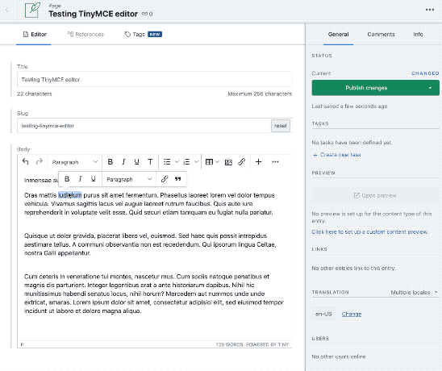
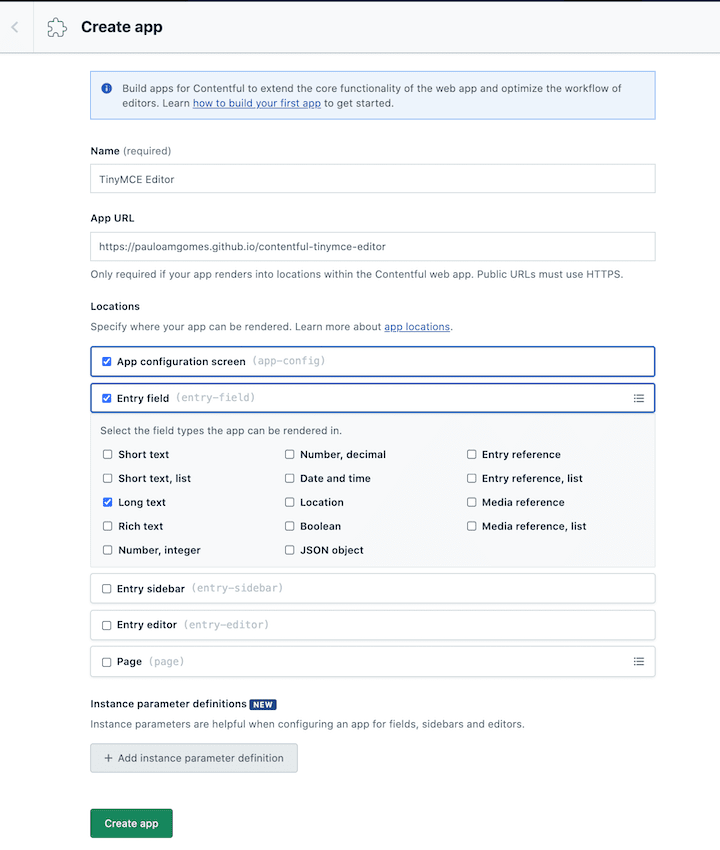
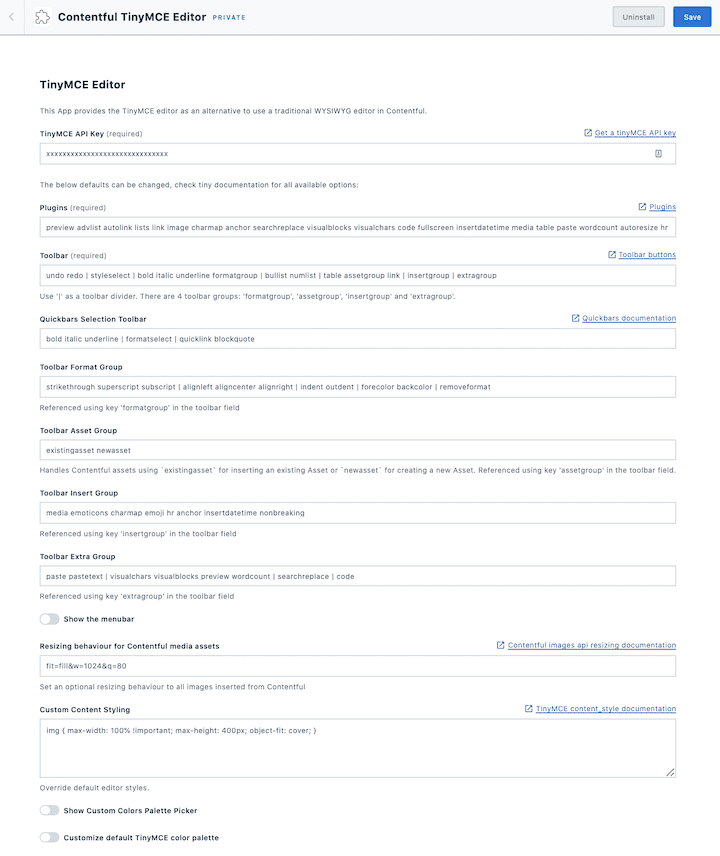
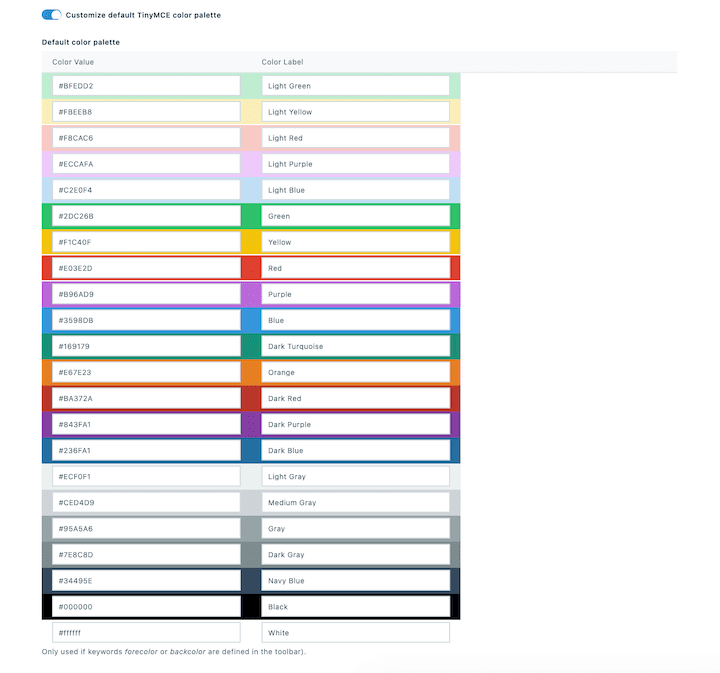

# Contentful TinyMCE Cloud Editor App

A [Contentful App](https://www.contentful.com/developers/docs/extensibility/app-framework/) that provides integration with the TinyMCE WYSIWYG editor.

For most of the cases using the core Contentful rich-field would be the best approach as the field contents are saved as structured data instead of plain text.
However, there are situations that a WYSIWYG approach makes more sense:

- You really need advanced tables
- Ability to copy/paste from word and maintain the formatting
- The extra formatting bits that are missing in rich-text like subscript, superscript, strikethrough
- You have legacy contents that due to the formatting would be very difficult to migrate to rich-text

## Setup

To install this app go to your `organization settings` > `manage private apps` and click in `create app`.

Define the application name (e.g. TinyMCE Editor) and use the following App URL: `https://pauloamgomes.github.io/contentful-tinymce-editor` and
ensure that the options `App configuration screen` and `Entry field > Long text` are checked.

Install the App in the desired space/environment:

Configure the TinyMCE settings, defaults are provided but you can change them:

Some settings are optional like the customization of the default color palette:

## Development

> This project was bootstrapped with [Create Contentful App](https://github.com/contentful/create-contentful-app).

In the project directory, you can run:

#### `npm start`

Creates or update your app definition in contentful, and runs the app in development mode.
Open your app to view it in the browser.

The page will reload if you make edits.
You will also see any lint errors in the console.

#### `npm run build`

Builds the app for production to the `build` folder.
It correctly bundles React in production mode and optimizes the build for the best performance.

The build is minified and the filenames include the hashes.
Your app is ready to be deployed!

## Limitations

Currently, the App framework doesn't provide configuration of instance parameters per field, so all settings are global to the space that the app is installed.

## Copyright and license

Copyright 2020 pauloamgomes under the MIT license.
